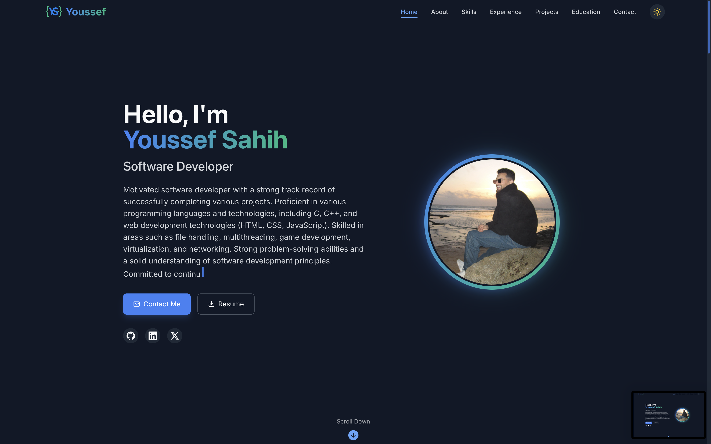

# Modern Portfolio Website

A modern, responsive portfolio website built with Next.js, TypeScript, and Tailwind CSS, featuring smooth animations and interactive components.



## 🌟 Features

- **Modern Design**: Clean and professional UI with dark/light mode support
- **Responsive Layout**: Fully responsive design that works on all devices
- **Smooth Animations**: Engaging animations using Framer Motion
- **Interactive Components**: Dynamic sections with hover effects and transitions
- **Type Safety**: Built with TypeScript for better development experience
- **Contact Form**: Functional contact form with EmailJS integration
- **Performance Optimized**: Fast loading times and smooth scrolling
- **SEO Friendly**: Optimized for search engines

## 🚀 Key Sections

- **Hero Section**: Engaging introduction with typewriter effect
- **About**: Professional summary with animated qualities cards
- **Skills**: Interactive skill cards with proficiency indicators
- **Projects**: Filterable project gallery with detailed modal views
- **Experience**: Dynamic timeline showcasing professional journey
- **Education**: Timeline-based education history
- **Contact**: Interactive contact form with social media links

## 🛠️ Technologies Used

- **Frontend Framework**: Next.js 14
- **Styling**: Tailwind CSS
- **Animations**: Framer Motion
- **Icons**: Lucide React
- **Form Handling**: EmailJS
- **Notifications**: React Hot Toast
- **Development**: TypeScript
- **Package Manager**: npm/yarn

## 📦 Installation

1. Clone the repository:
```bash
git clone https://github.com/yourusername/portfolio.git
```

2. Install dependencies:
```bash
cd portfolio
npm install
```

3. Create a `.env.local` file and add your EmailJS credentials:
```env
NEXT_PUBLIC_EMAILJS_SERVICE_ID=your_service_id
NEXT_PUBLIC_EMAILJS_TEMPLATE_ID=your_template_id
NEXT_PUBLIC_EMAILJS_USER_ID=your_user_id
```

4. Run the development server:
```bash
npm run dev
```

5. Open [http://localhost:3000](http://localhost:3000) in your browser

## 🔧 Configuration

Customize your portfolio by modifying the following files:

- `app/data/resume-data.ts`: Update your personal information, skills, and projects
- `public/`: Add your images and resume PDF
- `app/globals.css`: Modify the color scheme and global styles

## 📱 Responsive Design

The portfolio is fully responsive and optimized for:
- Mobile devices
- Tablets
- Desktops
- Large screens

## ⚡ Performance

- Optimized images and assets
- Lazy loading components
- Efficient animation handling
- Minimal bundle size

## 🎨 Customization

### Theme Colors

The color scheme can be customized in `globals.css`:
```css
:root {
  --background-light: 0 0% 100%;
  --background-dark: 222.2 84% 4.9%;
  --primary: 221.2 83.2% 53.3%;
  --secondary: 142.1 76.2% 36.3%;
  /* ... other color variables */
}
```

### Content

Update your information in `resume-data.ts`:
```typescript
export const RESUME_DATA = {
  name: "Your Name",
  location: "Your Location",
  about: "Your Description",
  // ... other personal information
};
```

## 📄 License

This project is licensed under the MIT License - see the [LICENSE](LICENSE) file for details.

## 🤝 Contributing

Contributions are welcome! Please feel free to submit a Pull Request.

## 📞 Contact

For any questions or feedback, please reach out:
- Email: ucefsahih@gmail.com
- LinkedIn: [Youssef Sahih](https://www.linkedin.com/in/youssef-sahih/)
- GitHub: [@ysahih](https://github.com/ysahih)

---

Built with ❤️ by Youssef Sahih
